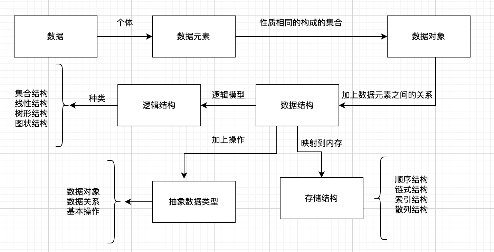
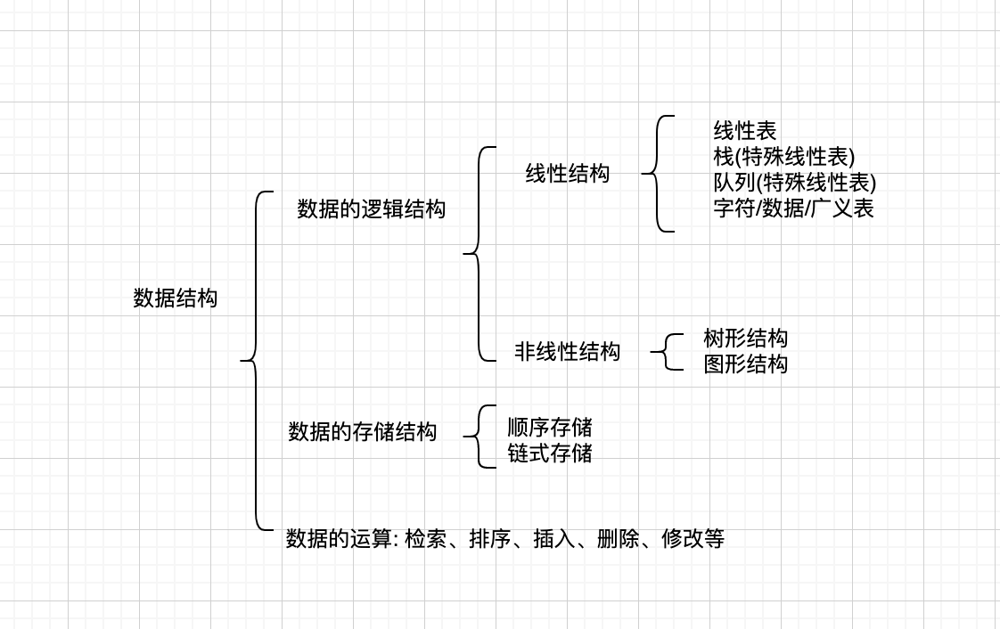

# 1 绪论

## 1.1 数据结构研究

## 1.2 基本概念和术语

### 存储结构

- 顺序存储结构
  - 用一组
- 链接存储结构
  - 用一组`任意`的存储单元存储数据元素,数据元素之间的逻辑关系用`指针`表示
- 索引存储结构
- 散列存储结构

### 数据类型和抽象数据类型

## 1.3 抽象数据类型的表示与实现

## 1.4 算法与算法分析

## 算法设计的要求

- 正确性
- 可读性
- 健壮性
- 高效性

## 时间复杂度 O

## 空间复杂度 S

